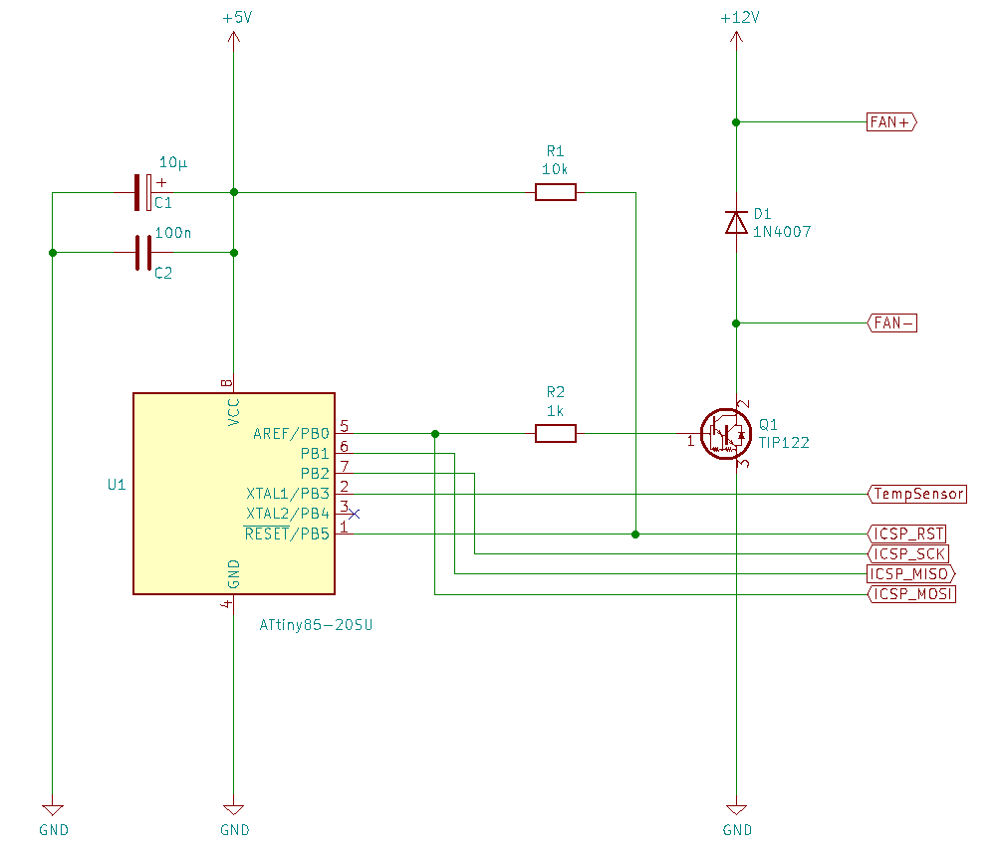
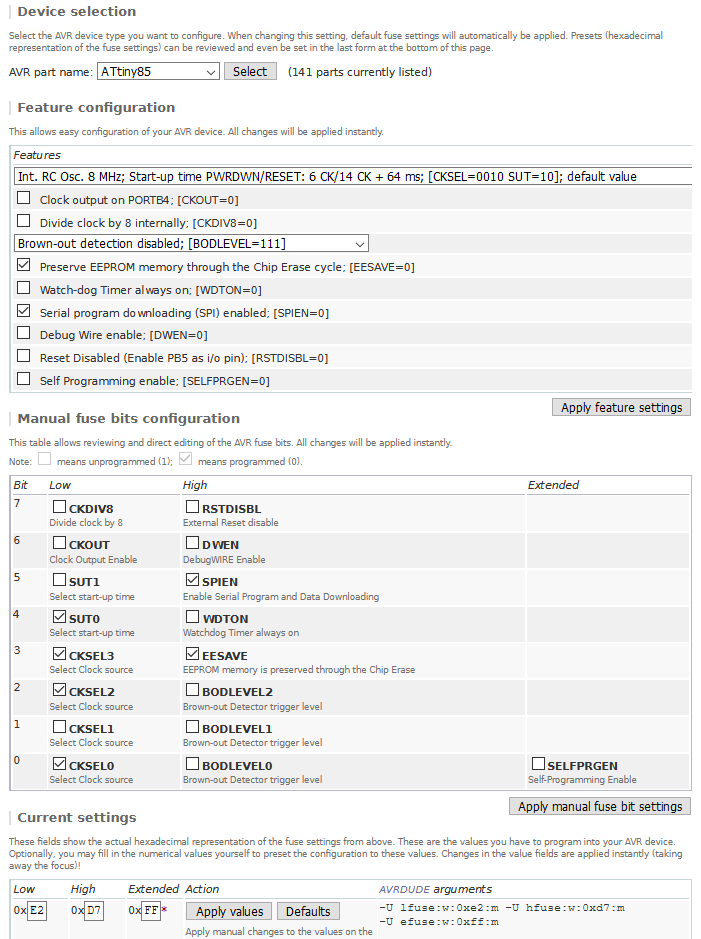

# Fan-Control
### Controls by temerature the speed of a fan driven with PWM
***
This small project is intended for cooling situations where the focus is on maximum noise reduction. To achieve this goal, the temperature is measured with a sensor (LM35DT) and processed by a microcontroller. This µController generates a pulse width modulated signal with 32kHz for a fan. The duty cycle of this PWM is directly proportional to the measured temperature.

Only a few parts are needed. The software can be realized with the Arduino IDE or ohters. I use Visual Studio with the <br>[Visual Micro Plugin](https://www.visualmicro.com/), but also Atmel Studio or others should working well. Here we use an Atmel ATtiny85, but other types with at least one analog input and a PWM capable output are also suitable.
The program is small enough to work on narrow-breasted microcontrollers. Only an internal clock frequency of 8MHz is necessary to output the PWM signal at 32kHz. This frequency is necessary, because some fans tend to produce an unpleasant whistling sound at low frequencies. The controlled temperature range is between 0 and 150 degrees Celsius.

The example shown here, refers to an ATtiny85 from Atmel. For other types or manufacturers other fuses may be set. These can be found in the respective documentations of the µController.

Circuit diagram and board layout are also included. These files are created with KiCad.
***
For the hardware you need the following (fits on the attached board layout):
+ Atmel ATtiny85 or similar (SOIC-8)
+ Board mounted Temperature Sensor LM35DT (TO220) 
+ Darlington transistor TIP122 (TO220)
+ Diode 1N4007 (THT)
+ Resistors: 1k, 10k (SMD 0805)
+ Capacitors: 100n, 10µ (SMD 0603)
+ Connectors: 1x 2Pin, 1x 3Pin, 1x 4Pin (THT)
+ Pinheader 02x06 Pins (THT)
+ 12V DC fan

The project requires two DC voltages, 5V for the µController and 12V for the fan. The power consumption at 12V depends on the fan type. The control needs very little current (max.12mA). In order to cope with an increased power consumption of the fan, it is recommended to provide the transistor with a heat sink. At low current consumption, the transistor can be operated without.
The circuit board is designed in such a way that the transistor is soldered in reverse, with the front side lying on the board, so that the heat sink I have in stock, can be mounted as flat as possible.

The parts I used for the circuit board were still available in my workshop. Of course, the used parts can vary in size and shape. It is only important that the microcontroller used, harmonizes with the software and that the peripherals can be controlled safely.
***
The circuit diagram is quite clear and does not require any great explanation. 
<p align="left"></p>

***

In order to define the ranges for the control, the header file **Fancontrol.h** contains some constants, which can be adapted to the respective requirements.

```c
// Temperature values to define the ranges.
// We use no float variables, all temperatures gets calculated in 16Bit uint16_t!
// This means a value of 2350 corresponds to a temperature of 23.50 degrees Celsius
constexpr auto TEMP_MINHYS  = 2350; // Hysteresis for minimum temp to switch off the running fan
constexpr auto TEMP_MIN     = 2500; // Minimum Temp to switch on the fan
constexpr auto TEMP_NORMHYS = 2850; // Hysteresis for temp to switch normal range off
constexpr auto TEMP_NORM    = 3000; // Start of normal range
constexpr auto TEMP_MID     = 5000; // Temp to go to high range
constexpr auto TEMP_MAX     = 7500; // Max temperature
```

There are also constants for the adaptation of the used fan. Not every fan runs with the same PWM values.
```c
// Fan responsible parameter to run the fan in smooth and low noise as possible
// Adjust this values to your fan model!
constexpr auto FAN_OFF      =   0; //
constexpr auto FAN_LOWLOW   =  63; // Lowest PWM to run the fan save on minimum noise
constexpr auto FAN_LOW      =  75; // Minimum for controlled "normal" run
constexpr auto FAN_MID      = 150; // Maximum for controlled normal run and minimum for high speed run
constexpr auto FAN_HIGH     = 255; // Maximum for controlled high speed
```
***
To operate the µController with 8MHz some fuses must be set. For the Arduino IDE, this is described in the file [How2SetCPUFuses.txt](/Arduino/FanControl/How2SetCPUFuses.txt).

On the web site [Engbedded](http://www.engbedded.com/fusecalc) you can find a "AVR Fuse Calculator". Here you can verify the Low, High and Extended fuses.
```
avrdude: safemode: lfuse reads as E2
avrdude: safemode: hfuse reads as D7
avrdude: safemode: efuse reads as FF
```
<p align="left"></p>

***
ISP is used to program the microcontroller. It is also possible to flash the µcontroller before soldering and omit the pin headers for ISP. For adjustments to the program it is recommended to mount the 6pin header.
